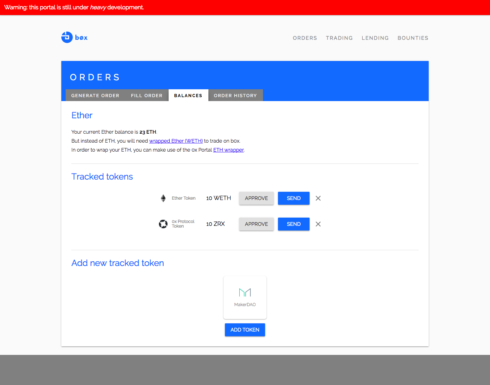

# b0x Portal

Frontend portal for the b0x network.

__Note:__ This project is still under *heavy* construction.

Screenshots:

<p align="center">
  
</p>

<p align="center">
  
</p>

## Development Setup

1. Link the `b0x.js` library as per instructions below.

2. Run `npm install` at the project root.

3. Run `npm run dev` to start up the development server.

### Link b0x.js

This portal depends on b0x.js, which is a javascript library for interfacing with the b0x network.

In order to interface with the development version of this library, you'll need to link it with `npm link`.

1. Navigate to the `b0x.js` repository, and type `npm link` in the command line.

2. Navigate back to this repository, and type `npm link b0x.js` to link the module for this project.

### Visual Studio Code

If you are using VSCode as your editor, make sure to install the following packages:

* ESLint

Your settings for optimal developer experience (DX) should include:

```json
{
  "eslint.autoFixOnSave": true
}
```

## Building for Production

1. Ensure dependencies are installed: `npm install`.
2. Ensure that pages to be exported are specified in `next.config.js`.
3. Type `npm run build` and your static output will be located in the `/dist` directory.

## Running a Production Build Locally

1. Build production files: `npm run build`
1. Start local server: `npm run prod`